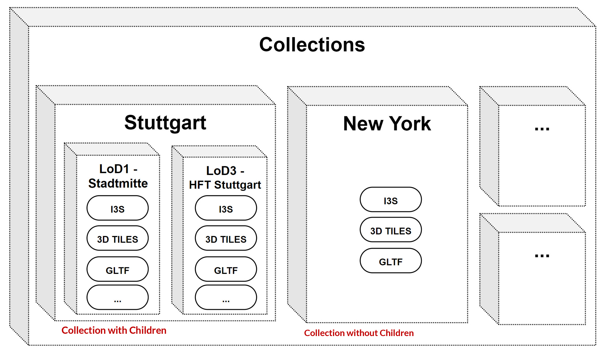

# 3DGeoVolumesAPI

### Live Demo: https://steinbeis-3dps.eu/3DGeoVolumes/


## Installation

Use the package manager [npm](https://npmjs.com/) to install 3D GeoVolumes API.

```bash
npm install
```

## Usage
### Starting server
1. Run `node server.js` (or any node manager - pm2/ nodemon) at your project folder.
2. Access to the GeoVolumes
   * **Landing Page**:  `http://localhost:port`
   * **Collections**: `http://localhost:port/collections`
   * **Collections with bbox filter**: `http://localhost:port/collections?bbox=minx,miny,maxx,maxy`

### Adding Collection Contents
* Add contents to `3DGeoVolumes\collections\collections.json` 
* The 3D contents may be added directly in the collection folder or linked as HREF to the original source.
  * tileset.json (Cesium 3D Tiles)
  * i3s service json (ESRI Scene index)
  * gltf (direct file)

### Configuration
* Port can be adjusted in the `server.js` file. 

## Contributing
Pull requests are welcome. For major changes, please open an issue first to discuss what you would like to change.

Please make sure to update tests as appropriate.

## Author 
BinwenWu Wuhan University

Get in touch: binwenwu@whu.edu.cn

## Link
| Document                                                         | URL                                 |
|------------------------------------------------------------------|-------------------------------------|
| 3D Data Container and Tiles API Pilot Summary Engineering Report | http://docs.ogc.org/per/20-031.html |
| Interoperable Simulation and Gaming Sprint Engineering Report    | http://docs.ogc.org/per/20-087.html |
| Steinbeis Demo                                                   | https://steinbeis-3dps.eu |

## Citation
```
BinwenWu, WHU. (2024). OGC 3D GeoVolumes API. Tankenqi. https://www.tankenqi.cn
```
